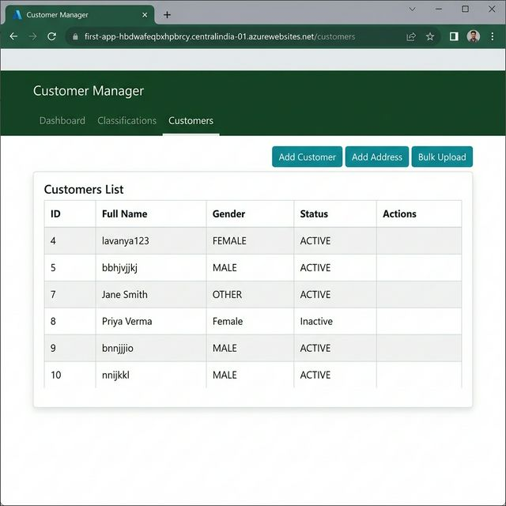
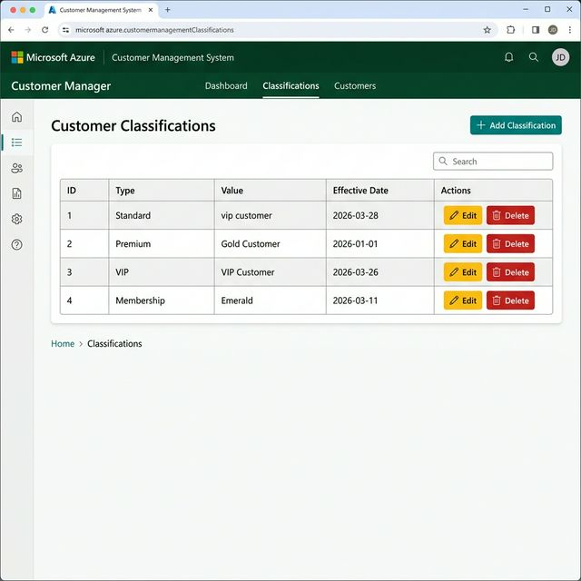

# 🚀 Azure Cloud Deployment — Customer Management System

**Live URL:** https://first-app-hbdwafeqbxhpbrcy.centralindia-01.azurewebsites.net

**GitHub Repository:** https://github.com/lavanyaxx/customer-management-system

---

## ✅ Deployment Proof

The Customer Management System is successfully deployed and running on **Microsoft Azure App Service** in the **Central India** region using:

- **Runtime:** Java 21 SE
- **Platform:** Azure App Service (Linux)
- **CI/CD:** GitHub Actions (automated build + deploy on every push to `main`)
- **Database:** H2 In-Memory (Azure-hosted)

---

## 📸 Screenshots

### Customers Page — Live on Azure
The Customers page shows all registered customer records loading correctly from the cloud-deployed backend.



---

### Customer Classifications Page — Live on Azure
The Classifications page verifies the full Angular + Spring Boot stack is functioning end-to-end.



---

## ⚙️ CI/CD Pipeline

Deployment is fully automated via **GitHub Actions** (`.github/workflows/main_first-app.yml`):

1. **Code is pushed** to the `main` branch on GitHub.
2. **GitHub Actions** spins up an Ubuntu runner, installs **Node.js 18** + **Java 21**.
3. **Maven Wrapper** builds the full project (Angular frontend + Spring Boot backend in a single JAR) with `./mvnw clean package -DskipTests`.
4. The compiled `.jar` is uploaded as a build artifact.
5. **Azure Web App Deploy** action pushes the JAR directly to the App Service.

---

## 🛠️ Azure Configuration

| Setting | Value |
|---------|-------|
| **App Name** | `first-app` |
| **Resource Group** | `mywebapp-pka` |
| **Region** | Central India |
| **Runtime Stack** | Java 21 SE |
| **OS** | Linux |
| **App Service Plan** | ASP-mywebapppka-82a7 (F1: Free) |
| **Subscription** | Azure for Students |

---

## 📁 Project Structure

```
Flow-main 2/
├── src/
│   ├── main/java/         # Spring Boot backend (REST APIs)
│   └── main/angular/      # Angular 17 frontend
├── python_analytics/      # Lab 10 & 11 Python reports
│   ├── lab10_reports.py
│   └── lab11_visualisation.py
├── .github/workflows/     # Azure CI/CD pipeline
└── pom.xml
```
